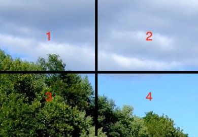
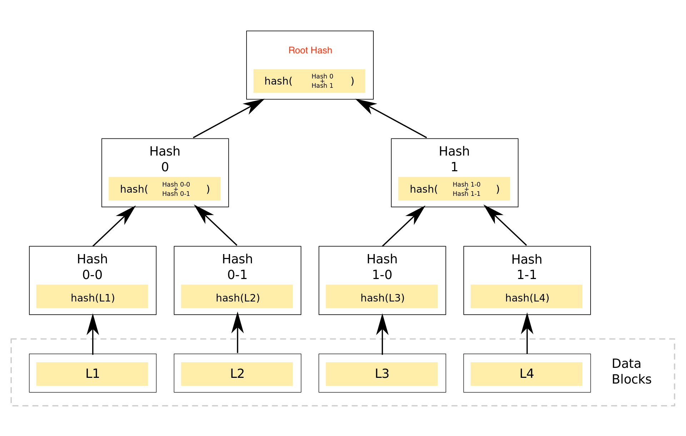

# ZKP data market

### What is DataMarket
DataMarket is a data publish protocol using Zero-knowledge proof (ZKP). The inspiration of the data market comes from the preview of the video website. After the user watches a 3-minute preview, the user can choose whether to pay for this for this purpose, we can enjoy the full video. We use Zero knowleage proof technology to achieve preview data Partial of all data. DataMarket supports data publish, Fundraising, and back the data you want to support.

### How is works
PS: Take picture data as an example 

#### 1：Zero knowleage proof

1： Build Zero-knowledge proof
When input the image, we will split the picture, and the 1 part of the picture will be reveal as the preview, and then we build Merkle tree according to each Data block      
   

   

and then. We build a merkle tree inclusion prove that hash(L1) is a leaf node of the merkle tree 

#### 2: Verify Zero-knowledge proof

We build a merkle tree inclusion prove that hash(L1) is a leaf node of the merkle tree

### Smart contract 
The seller will encrypt the source data and then provide the private key to withdrawl eth 

### Create Data item 
When creating market data items, the following core parameters will be written to the contract.    

1：merkle tree root hash   
2：private key hash

#### Data publish
Publisher provide private keys used by encrypted data to publish data, and the contract will also transfer the received ETH into the publisher account. 
